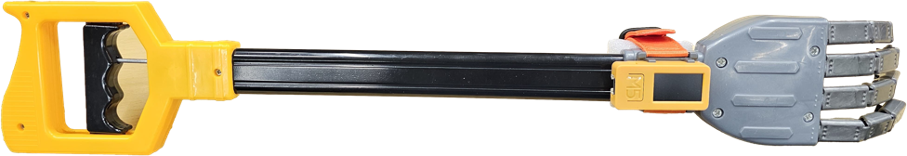
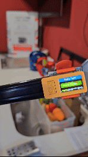

# Magic Hand Assistive Gripper

<div align="center">
  
  <p><i>Smart motion-sensitive assistive device providing real-time feedback for elderly users</i></p>
</div>

[](https://opensource.org/licenses/MIT)
[](https://www.arduino.cc/)
[](https://www.espressif.com/en/products/socs/esp32)

## 📋 Overview

The Magic Hand Assistive Gripper is an ergonomic device designed specifically for elderly users to help them manipulate and transport objects with greater control and confidence. The device monitors movement quality in real-time and provides immediate audio feedback, helping users develop smoother handling techniques and reduce the risk of dropping objects.

### 🎯 Key Features

- **Ergonomic Design**: Finger length of 77.5mm and overall length of 300mm for comfortable handling
- **Intuitive Operation**: Simple push-handle mechanism activates the four-finger mechanical gripper
- **Motion Monitoring**: Integrated IMU sensor detects movement patterns and irregularities
- **Real-time Feedback**: Built-in buzzer provides audio cues when jerky movements are detected
- **Compact Control System**: Powered by the M5StickC Plus2 microcontroller with built-in components
- **Wireless Capabilities**: WiFi connectivity enables potential remote monitoring applications

<div align="center">
  
  <p><i>Magic Hand gripper operation demonstration</i></p>
</div>

## 🚀 Getting Started

### Prerequisites

- [Arduino IDE](https://www.arduino.cc/en/software) (1.8.x or newer)
- [M5StickC Plus2 Board Package](https://docs.m5stack.com/en/quick_start/m5stickc_plus2/arduino)
- USB Type-C cable

### Hardware Assembly

1. Ensure the M5StickC Plus2, the Magic Hand gripper, and the connecting assembly are available.
2. Connect the M5StickC Plus2 to the Magic Hand gripper mechanism using the provided mounting hardware.
3. Secure all connections and ensure the gripper mechanism operates smoothly.

### Software Installation

```bash
# Clone this repository
git clone https://github.com/anh0001/magic-hand-assistive-gripper.git

# Navigate to the project directory
cd magic-hand-assistive-gripper
```

#### Setting up the Arduino IDE

1. Install the [M5StickC Plus2 library](https://github.com/m5stack/M5StickC-Plus2) via the Arduino Library Manager
2. Open the main sketch in the Arduino IDE:
   ```
   src/magic_hand_main/magic_hand_main.ino
   ```
3. Select "M5StickC Plus2" from the Board menu
4. Connect your M5StickC Plus2 via USB and select the appropriate port
5. Upload the sketch to your device

## 🛠️ Usage

1. **Power On**: Press and hold Button C on the M5StickC Plus2 for more than 2 seconds
2. **Grip Operation**: 
   - Push the black handle to the left to close the gripper's fingers
   - Release to open the fingers
3. **Feedback System**:
   - The buzzer remains silent during smooth movements
   - The buzzer beeps at increasing frequency when jerky movements are detected
   - Use this feedback to practice and develop smoother handling techniques
4. **Power Off**: Press and hold Button C for more than 6 seconds

## 📊 Technical Details

### Hardware Specifications

| Component | Specification |
|-----------|---------------|
| Microcontroller | ESP32-PICO-V3-02 (240MHz dual-core) |
| Motion Sensor | MPU6886 6-Axis IMU |
| Display | 1.14" TFT (135×240) |
| Battery | 200mAh LiPo |
| Connectivity | WiFi |
| Gripper Length | 300mm |
| Finger Length | 77.5mm |
| Audio Feedback | Built-in passive buzzer |

### System Architecture

The system uses the built-in IMU (Inertial Measurement Unit) of the M5StickC Plus2 to detect acceleration and rotational changes. The software processes this data in real-time to identify movement patterns:

1. **Data Acquisition**: Continuous sampling from the accelerometer and gyroscope
2. **Movement Analysis**: Processing of motion data to detect irregularities
3. **Feedback Generation**: Activation of the buzzer with varying frequency based on movement quality

## 🏗️ Project Structure

```
magic-hand-assistive-gripper/
├── src/                           # Source code
│   └── magic_hand_main/           # Main Arduino sketch folder
│       ├── magic_hand_main.ino    # Primary sketch file
│       ├── config.h               # Configuration parameters
│       └── imu_handler.h          # IMU sensor handling functions
├── docs/                          # Documentation
│   ├── hardware/                  # Hardware specifications
│   └── images/                    # Project images
├── hardware/                      # Hardware design files
└── tests/                         # Test code and procedures
```

## 🔄 Future Enhancements

- **User Profiles**: Customizable sensitivity settings for different user needs
- **Mobile App**: Companion application for extended feedback and progress tracking
- **Visual Feedback**: Adding LED indicators for users with hearing impairments
- **Force Sensors**: Integration of pressure sensors for grip strength monitoring
- **Data Logging**: Recording movement patterns for analysis and improvement

## 🤝 Contributing

Contributions to improve the Magic Hand Assistive Gripper are welcome! Please feel free to submit a Pull Request.

1. Fork the repository
2. Create your feature branch (`git checkout -b feature/AmazingFeature`)
3. Commit your changes (`git commit -m 'Add some AmazingFeature'`)
4. Push to the branch (`git push origin feature/AmazingFeature`)
5. Open a Pull Request

## 📜 License

This project is licensed under the MIT License - see the [LICENSE](LICENSE) file for details.

## 🙏 Acknowledgments

- [M5Stack](https://m5stack.com/) for the M5StickC Plus2 platform
- All contributors to this assistive technology project
- The elderly care community for feedback and testing

---

<div align="center">
  <p>Made with ❤️ for enhancing elderly independence and quality of life</p>
  <p>© 2025 Magic Hand Assistive Gripper Project</p>
</div>